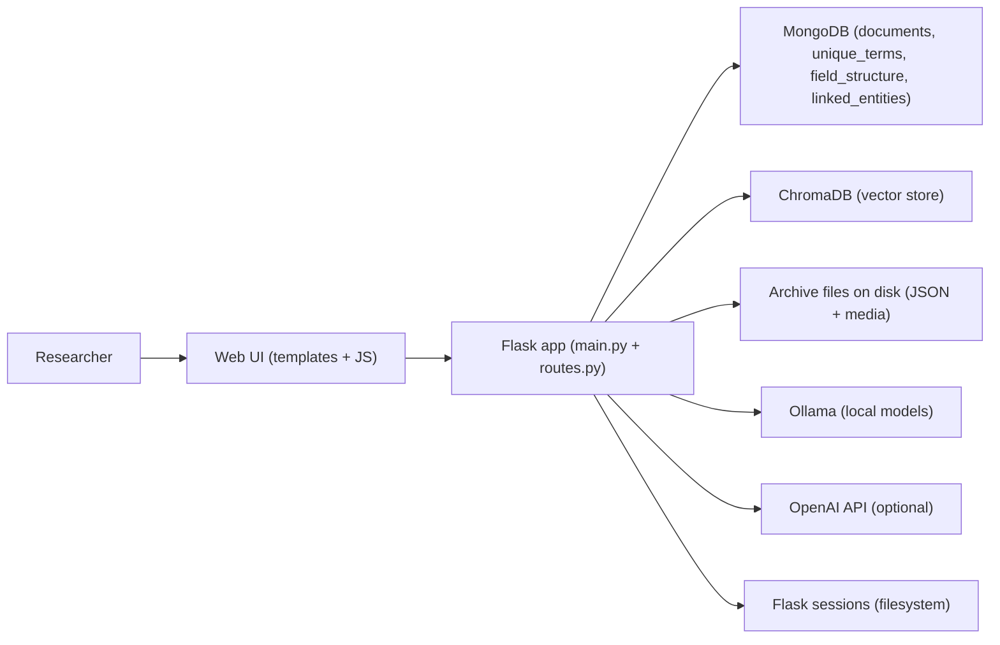

# Architecture and File Map
<!-- Added a new architecture document with explicit scope and file inventory. -->

## Scope and conventions
<!-- Added scope/definitions so readers know how to interpret the inventory. -->

This document describes how the system fits together, lists every file currently present in the repository checkout, flags files that are orphans or generated artifacts, and highlights refactoring opportunities and critical architectural improvements. “Orphan” means not referenced by the running Flask application or the documented setup workflows, based on a code and docs scan. <!-- Added definitions for “orphan” and scope to avoid ambiguity. -->

## System relationships
<!-- Added a high-level relationship map for the core runtime. -->

<!-- Added a diagram to show the runtime flow and dependencies. -->

Key relationships:
- `app/main.py` creates the Flask app and loads config.
- `app/routes.py` defines all HTTP endpoints, including search, document views, settings, and RAG handlers.
- `app/historian_agent/` contains RAG pipeline modules used by the Historian Agent endpoints.
- `app/database_setup.py` and `app/data_processing.py` implement ingestion logic and Mongo utilities.
- `app/templates/` and `app/static/` implement the UI layer, including the Historian Agent chat and settings UI.
<!-- Added concrete file-to-function relationships for quick orientation. -->

## Data architecture
<!-- Added a focused data architecture summary for MongoDB, ChromaDB, and files. -->

**Primary stores**:
- **MongoDB** (`railroad_documents`): `documents`, `unique_terms`, `field_structure`, `linked_entities`, plus `document_chunks` for RAG. The current dataset schema is documented in `app/data_structure.md`, including the ObjectId vs string mismatch between parent IDs and chunk references. <!-- Added Mongo collections and the critical ID type mismatch. -->
- **ChromaDB**: persistent vector embeddings for chunk retrieval (mounted at `CHROMA_PERSIST_DIRECTORY` when enabled). <!-- Added vector store role and mount context. -->
- **Filesystem archives**: JSON/JSONL metadata and associated media under `ARCHIVES_HOST_PATH`, mounted into the container as `ARCHIVES_PATH`. <!-- Added the file system archive relationship. -->
- **Filesystem sessions**: Flask session files under `SESSION_HOST_PATH` and `SESSION_PATH`. <!-- Added session storage role. -->

**Ingestion flow (batch)**:
- `app/bootstrap_data.sh` → `app/database_setup.py` → `app/data_processing.py` → `app/setup/generate_unique_terms.py` → `app/setup/ner_processing.py` → `app/entity_linking.py`. <!-- Added the concrete batch pipeline path. -->

**RAG flow (vector)**:
- `app/historian_agent/setup_rag_database.py` creates indexes and initializes Chroma collections.
- `app/historian_agent/embed_existing_documents.py` chunks documents, generates embeddings, and writes to Mongo + Chroma.
- `app/historian_agent/rag_query_handler.py`, `adversarial_rag.py`, and `iterative_adversarial_agent.py` implement the Good/Better/Best modes. <!-- Added the vector pipeline sequence. -->

## Dynamic document display
<!-- Added how the UI renders heterogeneous documents. -->

`app/templates/document-detail.html` renders document pages based on the fields present in each record. It conditionally shows `summary`, `ocr_text`, `sections`, `extracted_entities`, and optional `person_synthesis`. Nested JSON structures are rendered recursively so new record formats can appear without template updates. Images are resolved by stripping `.json` from the stored archive-relative path and serving the matching media file if it exists. <!-- Added UI rendering logic so users understand format adaptability. -->

## Historian-driven concerns
<!-- Added the historian-first framing to document the rationale. -->

The system is oriented toward archival practice: it keeps OCR text next to images for verification, exposes citations and source IDs, and allows users to tune retrieval methods for evidence depth. The pipeline surfaces defaults in `.env` and the UI so methodological choices (model, provider, retrieval depth) are explicit and repeatable. The design favors provenance, transparency, and source validation over opaque automation. <!-- Added historian-centered goals and workflows. -->

## File inventory (all files)
<!-- Added a complete, grouped inventory with roles and orphan tags. -->

### Top level
<!-- Added top-level file map for repo orientation. -->

| Path | Role / relationship | Status |
| --- | --- | --- |
| `.DS_Store` | macOS Finder metadata. | Generated artifact. |
| `.dockerignore` | Docker build ignore list for the repo root. | Build config. |
| `.env` | Environment variables consumed by Docker Compose and scripts. | Runtime config. |
| `.git/COMMIT_EDITMSG` | Git metadata. | VCS metadata. |
| `.git/FETCH_HEAD` | Git metadata. | VCS metadata. |
| `.git/HEAD` | Git metadata. | VCS metadata. |
| `.git/ORIG_HEAD` | Git metadata. | VCS metadata. |
| `.git/config` | Git metadata. | VCS metadata. |
| `.git/description` | Git metadata. | VCS metadata. |
| `.git/hooks/applypatch-msg.sample` | Git sample hook. | VCS metadata. |
| `.git/hooks/commit-msg.sample` | Git sample hook. | VCS metadata. |
| `.git/hooks/fsmonitor-watchman.sample` | Git sample hook. | VCS metadata. |
| `.git/hooks/post-update.sample` | Git sample hook. | VCS metadata. |
| `.git/hooks/pre-applypatch.sample` | Git sample hook. | VCS metadata. |
| `.git/hooks/pre-commit.sample` | Git sample hook. | VCS metadata. |
| `.git/hooks/pre-merge-commit.sample` | Git sample hook. | VCS metadata. |
| `.git/hooks/pre-push.sample` | Git sample hook. | VCS metadata. |
| `.git/hooks/pre-rebase.sample` | Git sample hook. | VCS metadata. |
| `.git/hooks/pre-receive.sample` | Git sample hook. | VCS metadata. |
| `.git/hooks/prepare-commit-msg.sample` | Git sample hook. | VCS metadata. |
| `.git/hooks/push-to-checkout.sample` | Git sample hook. | VCS metadata. |
| `.git/hooks/sendemail-validate.sample` | Git sample hook. | VCS metadata. |
| `.git/hooks/update.sample` | Git sample hook. | VCS metadata. |
| `.git/index` | Git metadata. | VCS metadata. |
| `.git/info/exclude` | Git metadata. | VCS metadata. |
| `.git/logs/HEAD` | Git metadata. | VCS metadata. |
| `.git/packed-refs` | Git metadata. | VCS metadata. |
| `.gitignore` | Repo ignore rules. | Build config. |
| `AGENTS.log` | Change log required by AGENTS.md. | Process doc. |
| `AGENTS.md` | Agent rules and workflow requirements. | Process doc. |
| `Historian Agent v1 Implementation Design Document.pdf` | Legacy design PDF reference. | Documentation. |
| `__pycache__/app.cpython-38.pyc` | Python bytecode cache. | Generated artifact. |
| `__pycache__/database_setup.cpython-38.pyc` | Python bytecode cache. | Generated artifact. |
| `__pycache__/routes.cpython-38.pyc` | Python bytecode cache. | Generated artifact. |
| `architecture.md` | This architecture and file map document. | Documentation. |
| `backup_db.py` | MongoDB backup helper using `mongodump`. | Manual utility. |
| `combined_project_files.txt` | Generated snapshot of an older file list. | Generated artifact [ORPHAN]. |
| `data_migration.py` | One-off script to copy BORR data into archives. | Manual utility. |
| `docker-compose.yml` | Primary Docker Compose configuration for app + Mongo. | Runtime config. |
| `quick_check.sh` | Diagnostics for Ollama, mounts, and ingestion readiness. | Manual utility. |
| `rag_requirements.txt` | Historical RAG dependency notes. | Documentation [ORPHAN]. |
| `readme.md` | Project overview and setup guide. | Documentation. |
| `requirements.txt` | Root dependency list (includes `app/requirements.txt`). | Dev/install config. |
| `restore_db.py` | MongoDB restore helper using `mongorestore`. | Manual utility. |
| `rsync_repeat.sh` | Rsync helper for repeated syncs. | Manual utility. |
| `rsync_restart.sh` | Rsync helper to restart syncs. | Manual utility. |
| `run_app.sh` | Wrapper for `docker compose up`. | Manual utility. |
| `setup.md` | Detailed setup instructions for Mac/Windows. | Documentation. |
| `todo.md` | Project task notes. | Documentation. |

### `app/`
<!-- Added the core application file map. -->

| Path | Role / relationship | Status |
| --- | --- | --- |
| `app/.DS_Store` | macOS Finder metadata. | Generated artifact. |
| `app/.dockerignore` | Docker build ignore list for the app image. | Build config. |
| `app/.env` | Local env file for app subdir (not used by Docker Compose). | Local config [ORPHAN]. |
| `app/CLI_ingestion_files_wip/CLI_README.md` | WIP CLI ingestion notes. | WIP [ORPHAN]. |
| `app/CLI_ingestion_files_wip/QUICK_REFERENCE.md` | WIP CLI ingestion reference. | WIP [ORPHAN]. |
| `app/CLI_ingestion_files_wip/check_status.py` | WIP CLI status helper. | WIP [ORPHAN]. |
| `app/CLI_ingestion_files_wip/example.env` | WIP example env file. | WIP [ORPHAN]. |
| `app/CLI_ingestion_files_wip/image_ingestion.py` | WIP ingestion variant. | WIP [ORPHAN]. |
| `app/CLI_ingestion_files_wip/image_ingestion_clean.py` | WIP ingestion variant. | WIP [ORPHAN]. |
| `app/CLI_ingestion_files_wip/ingest_cli.py` | WIP ingestion CLI entry point. | WIP [ORPHAN]. |
| `app/CLI_ingestion_files_wip/ingest_hpc_slurm.sh` | WIP HPC ingestion script. | WIP [ORPHAN]. |
| `app/CLI_ingestion_files_wip/ingest_parallel.py` | WIP parallel ingestion. | WIP [ORPHAN]. |
| `app/CLI_ingestion_files_wip/ingestion_pipeline.py` | WIP ingestion pipeline. | WIP [ORPHAN]. |
| `app/CLI_ingestion_files_wip/requirements.txt` | WIP CLI requirements. | WIP [ORPHAN]. |
| `app/Dockerfile` | Container build for the Flask app. | Runtime config. |
| `app/__init__.py` | Package marker for `app`. | Runtime module. |
| `app/__pycache__/config.cpython-312.pyc` | Python bytecode cache. | Generated artifact. |
| `app/__pycache__/main.cpython-312.pyc` | Python bytecode cache. | Generated artifact. |
| `app/__pycache__/routes.cpython-312.pyc` | Python bytecode cache. | Generated artifact. |
| `app/bootstrap_data.sh` | Batch ingestion pipeline wrapper. | Manual utility. |
| `app/config.json` | UI configuration loaded per request. | Runtime config. |
| `app/config.py` | Config helpers for UI and app settings. | Runtime module. |
| `app/data_processing.py` | JSON ingestion and document insertion logic. | Runtime module. |
| `app/data_structure.md` | MongoDB schema notes for the dataset. | Documentation. |
| `app/database_processing.log` | Ingestion log output. | Generated artifact. |
| `app/database_setup.log` | Database setup log output. | Generated artifact. |
| `app/database_setup.py` | MongoDB connection and indexing utilities. | Runtime module. |
| `app/docker-compose.yml` | Legacy compose file inside app folder. | Duplicate config [ORPHAN]. |
| `app/entity_linking.prof` | Profiling output for entity linking. | Generated artifact. |
| `app/entity_linking.py` | Entity linking pipeline step. | Runtime module. |
| `app/entrypoint.sh` | Container entrypoint (waits on Mongo, optional bootstrap). | Runtime module. |
| `app/generate_unique_terms.prof` | Profiling output for unique term generation. | Generated artifact. |
| `app/image_ingestion.py` | OCR + JSON structuring for image ingestion. | Runtime module. |
| `app/llm_abstraction.py` | Model abstraction helpers. | Runtime module. |
| `app/llm_layer.py` | LLM helper utilities used by ingestion/RAG. | Runtime module. |
| `app/logs/embedding_cache.pkl` | Cached embeddings for experiments. | Generated artifact. |
| `app/logs/tier0_full_corpus_run.out` | Tier 0 run output log. | Generated artifact. |
| `app/logs/tier0_full_corpus_run_llama31_8b.out` | Tier 0 run output log. | Generated artifact. |
| `app/logs/tier0_full_run.out` | Tier 0 run output log. | Generated artifact. |
| `app/logs/tier0_run_100_report.json` | Tier 0 run report. | Generated artifact. |
| `app/logs/tier0_run_100_report_fast.json` | Tier 0 run report. | Generated artifact. |
| `app/logs/tier0_run_100_report_llama31_8b.json` | Tier 0 run report. | Generated artifact. |
| `app/logs/tier0_run_100_report_llama31_8b_compare.json` | Tier 0 run report. | Generated artifact. |
| `app/logs/tier0_run_100_report_llama31_8b_compare_v2.json` | Tier 0 run report. | Generated artifact. |
| `app/logs/tier0_run_100_report_llama31_8b_compare_v3.json` | Tier 0 run report. | Generated artifact. |
| `app/logs/tier0_run_100_report_llama31_8b_compare_v5.json` | Tier 0 run report. | Generated artifact. |
| `app/logs/tier0_run_100_report_llama31_8b_compare_v6.json` | Tier 0 run report. | Generated artifact. |
| `app/logs/tier0_run_100_report_qwen_fast.json` | Tier 0 run report. | Generated artifact. |
| `app/logs/tier0_run_20_report_llama31_8b.json` | Tier 0 run report. | Generated artifact. |
| `app/logs/tier0_run_20_report_llama31_8b_compare.json` | Tier 0 run report. | Generated artifact. |
| `app/logs/tier0_run_20_report_llama31_8b_compare2.json` | Tier 0 run report. | Generated artifact. |
| `app/logs/tier0_run_20_report_llama31_8b_compare3.json` | Tier 0 run report. | Generated artifact. |
| `app/logs/tier0_run_20_report_qwen32b_compare2.json` | Tier 0 run report. | Generated artifact. |
| `app/logs/tier0_run_300_report.json` | Tier 0 run report. | Generated artifact. |
| `app/logs/tier0_run_5_report.json` | Tier 0 run report. | Generated artifact. |
| `app/logs/tier0_run_full_report.json` | Tier 0 run report. | Generated artifact. |
| `app/logs/tier0_run_full_report_cronon.json` | Tier 0 run report. | Generated artifact. |
| `app/logs/tier0_run_full_report_latest.json` | Tier 0 run report. | Generated artifact. |
| `app/logs/tier0_sample_20_ids.json` | Tier 0 sample output. | Generated artifact. |
| `app/main.py` | Flask app factory and startup. | Runtime module. |
| `app/models.py` | ORM-like data structures and helpers (not SQLAlchemy). | Runtime module. |
| `app/profile_results.txt` | Profiling output. | Generated artifact. |
| `app/rag_base.py` | Base RAG utilities used by agent modules. | Runtime module. |
| `app/requirements.in` | Input dependency spec (used for updates). | Dev config. |
| `app/requirements.txt` | App dependency lock for Docker image. | Runtime config. |
| `app/routes.log` | Flask route logs. | Generated artifact. |
| `app/routes.py` | Flask routes and API endpoints. | Runtime module. |
| `app/run_full_corpus.py` | Tier 0 full-corpus runner. | Manual utility. |
| `app/setup.md` | Older setup guide in app directory. | Documentation [ORPHAN]. |
| `app/setup/DATABASE_SETUP_DESIGN_v3.md` | Design doc for setup v3. | Documentation. |
| `app/setup/DELIVERABLES_SUMMARY.md` | Summary of setup deliverables. | Documentation. |
| `app/setup/database_processing.log` | Setup ingestion log output. | Generated artifact. |
| `app/setup/database_setup.log` | Setup database log output. | Generated artifact. |
| `app/setup/generate_unique_terms.py` | Unique term calculation for setup flow. | Manual utility. |
| `app/setup/ner_processing.log` | Setup NER log output. | Generated artifact. |
| `app/setup/ner_processing.py` | NER processing for setup flow. | Manual utility. |
| `app/setup/ner_processor_llm.py` | LLM NER helper for setup flow. | Manual utility. |
| `app/setup/ner_worker.py` | Worker for NER processing. | Manual utility. |
| `app/setup/person_synthesis.py` | Person synthesis batch runner. | Manual utility. |
| `app/setup/setup_databases.py` | MongoDB collection/index initialization. | Manual utility. |
| `app/setup/setup_ingest_data.py` | Standalone ingestion script. | Manual utility. |
| `app/setup/setup_rag_database.log` | Setup RAG log output. | Generated artifact. |
| `app/setup/test_synthesis.py` | Person synthesis test script. | Manual utility. |
| `app/show_env.prof` | Profiling output. | Generated artifact. |
| `app/show_env.py` | Environment inspection helper. | Manual utility. |
| `app/static/data_ingestion_model_selector.js` | Ingestion selector UI logic. | Runtime asset. |
| `app/static/historian_agent.js` | Historian Agent frontend logic. | Runtime asset. |
| `app/static/script.js` | General UI scripts. | Runtime asset. |
| `app/static/settings_data_ingestion.js` | Settings ingestion frontend logic. | Runtime asset. |
| `app/static/style.css` | Global UI styles. | Runtime asset. |
| `app/templates/.DS_Store` | macOS Finder metadata. | Generated artifact. |
| `app/templates/base.html` | Base layout template. | Runtime asset. |
| `app/templates/data_files.html` | Archive file management UI. | Runtime asset. |
| `app/templates/database-info.html` | Database info UI. | Runtime asset. |
| `app/templates/document-detail.html` | Document detail UI. | Runtime asset. |
| `app/templates/document-list.html` | Document list UI. | Runtime asset. |
| `app/templates/error.html` | Error page template. | Runtime asset. |
| `app/templates/help.html` | Help page template. | Runtime asset. |
| `app/templates/historian_agent.html` | Historian Agent chat UI. | Runtime asset. |
| `app/templates/home.html` | Home page template. | Runtime asset. |
| `app/templates/login.html` | Login page template. | Runtime asset. |
| `app/templates/search-terms.html` | Search term analytics UI. | Runtime asset. |
| `app/templates/search.html` | Search UI. | Runtime asset. |
| `app/templates/settings.html` | Settings UI. | Runtime asset. |
| `app/test_db_connection.py` | MongoDB connectivity test (uses `MONGO_URI`). | Manual utility. |
| `app/test_spacy.py` | spaCy availability test. | Manual utility. |
| `app/test_tier0_smoke.py` | Tier 0 smoke test. | Manual utility. |
| `app/tier_agent_log/tier_agent_log_2025-12-23_20-04-12.log` | Tiered agent log output. | Generated artifact. |
| `app/tier_agent_log/tier_agent_log_2025-12-23_20-05-06.log` | Tiered agent log output. | Generated artifact. |
| `app/todo.md` | App-specific task notes. | Documentation. |
| `app/util/.env` | Local env file for utilities. | Local config [ORPHAN]. |
| `app/util/__init__.py` | Utility package marker. | Runtime module. |
| `app/util/analyze_files.py` | Archive analysis helper. | Manual utility. |
| `app/util/batch_download.py` | Batch download helper. | Manual utility. |
| `app/util/batch_upload.py` | Batch upload helper. | Manual utility. |
| `app/util/bigfile.py` | Large file helper. | Manual utility. |
| `app/util/count_files.py` | File counting helper. | Manual utility. |
| `app/util/delete_db.py` | Database delete helper (run in container). | Manual utility. |
| `app/util/document-detail_works.html` | Prototype UI snippet. | Prototype [ORPHAN]. |
| `app/util/export_linked_terms.py` | Export linked entities. | Manual utility. |
| `app/util/export_unique_terms.py` | Export unique terms. | Manual utility. |
| `app/util/generate_password.py` | Password generation helper. | Manual utility. |
| `app/util/json_validator.py` | JSON validation helper. | Manual utility. |
| `app/util/json_validator_multi.py` | Multi-file JSON validation helper. | Manual utility. |
| `app/util/mounts.py` | Docker mount inspection helpers used by settings. | Runtime module. |
| `app/util/random_texts.py` | Random text generator for tests. | Manual utility. |
| `app/util/reduce_files.py` | File reduction helper. | Manual utility. |
| `app/util/requirements_finder.py` | Dependency scanning helper. | Manual utility. |
| `app/util/test_mongo_connection.py` | Mongo connection helper. | Manual utility. |
| `app/util/test_openai.py` | OpenAI connectivity helper. | Manual utility. |

### `app/historian_agent/`
<!-- Added the RAG and agent module inventory. -->

| Path | Role / relationship | Status |
| --- | --- | --- |
| `app/historian_agent/.env` | Local env file for agent experiments. | Local config [ORPHAN]. |
| `app/historian_agent/SYSTEM_ARCHITECTURE_COMPLETE.md.pdf` | Architecture reference PDF. | Documentation. |
| `app/historian_agent/__init__.py` | Historian Agent config and retriever wiring. | Runtime module. |
| `app/historian_agent/adversarial_rag.py` | Better mode RAG handler with reranking. | Runtime module. |
| `app/historian_agent/chunking.py` | Chunking utilities for documents. | Runtime module. |
| `app/historian_agent/corpus_explorer.py` | Tier 0 corpus exploration pipeline. | Runtime module. |
| `app/historian_agent/embed_existing_documents.py` | Vector migration script (maintained). | Manual utility. |
| `app/historian_agent/embed_migration.log` | Migration log output. | Generated artifact. |
| `app/historian_agent/embed_migration.ollama.log` | Migration log output. | Generated artifact. |
| `app/historian_agent/embed_migration.verbose.log` | Migration log output. | Generated artifact. |
| `app/historian_agent/embeddings.py` | Embedding service adapter. | Runtime module. |
| `app/historian_agent/fix_imports.py` | One-off import fixer. | One-off [ORPHAN]. |
| `app/historian_agent/iterative_adversarial_agent.py` | Best mode tiered agent. | Runtime module. |
| `app/historian_agent/llm_error.txt` | Error capture from LLM runs. | Generated artifact. |
| `app/historian_agent/question_answerability.py` | Question evaluation utilities. | Runtime module. |
| `app/historian_agent/question_models.py` | Question model definitions. | Runtime module. |
| `app/historian_agent/question_pipeline.py` | Question pipeline logic. | Runtime module. |
| `app/historian_agent/question_synthesis.py` | Question synthesis utilities. | Runtime module. |
| `app/historian_agent/question_typology.py` | Question classification utilities. | Runtime module. |
| `app/historian_agent/question_validator.py` | Question validation utilities. | Runtime module. |
| `app/historian_agent/rag_query_handler.py` | Good mode RAG handler. | Runtime module. |
| `app/historian_agent/readme_rag.md` | RAG notes and performance analysis. | Documentation. |
| `app/historian_agent/reranking.py` | Cross-encoder reranking utilities. | Runtime module. |
| `app/historian_agent/research_notebook.py` | Research notebook utilities. | Runtime module. |
| `app/historian_agent/retrievers.py` | Keyword/vector/hybrid retrievers. | Runtime module. |
| `app/historian_agent/semantic_chunker.py` | Alternative chunking utilities. | Runtime module. |
| `app/historian_agent/setup_rag_database.log` | Setup RAG log output. | Generated artifact. |
| `app/historian_agent/setup_rag_database.py` | RAG setup script. | Manual utility. |
| `app/historian_agent/stratification.py` | Stratification utilities for analysis. | Runtime module. |
| `app/historian_agent/test_adversary_rag.py` | RAG test script. | Manual utility. |
| `app/historian_agent/test_chromadb_health.py` | Chroma health test. | Manual utility. |
| `app/historian_agent/test_chunks.py` | Chunking test. | Manual utility. |
| `app/historian_agent/test_document_structure.py` | Document structure test. | Manual utility. |
| `app/historian_agent/test_env.py` | Environment test. | Manual utility. |
| `app/historian_agent/test_field_count.py` | Field count test. | Manual utility. |
| `app/historian_agent/test_models.py` | Model availability test. | Manual utility. |
| `app/historian_agent/test_rag_system.py` | End-to-end RAG test. | Manual utility. |
| `app/historian_agent/test_sources.py` | Source mapping test. | Manual utility. |
| `app/historian_agent/test_verify_dimensions.py` | Embedding dimension test. | Manual utility. |
| `app/historian_agent/tier0_models.py` | Tier 0 model definitions. | Runtime module. |
| `app/historian_agent/tier0_utils.py` | Tier 0 utilities. | Runtime module. |
| `app/historian_agent/vector_store.py` | Vector store abstraction for Chroma. | Runtime module. |
| `app/historian_agent/verify_db.py` | DB verification helper. | Manual utility. |

### `docs/`
<!-- Added documentation inventory. -->

| Path | Role / relationship | Status |
| --- | --- | --- |
| `docs/.DS_Store` | macOS Finder metadata. | Generated artifact. |
| `docs/DATABASE_SETUP_DESIGN.md` | Database setup design and migration notes. | Documentation. |
| `docs/backend_complete_december.md` | Comprehensive backend architecture reference. | Documentation. |
| `docs/design_document_for_hpc_server_link_files/colorschememapping.xml` | Doc asset from exported design doc. | Documentation asset. |
| `docs/design_document_for_hpc_server_link_files/filelist.xml` | Doc asset from exported design doc. | Documentation asset. |
| `docs/design_document_for_hpc_server_link_files/themedata.thmx` | Doc asset from exported design doc. | Documentation asset. |
| `docs/hpc_distributed_design` | Placeholder for HPC design folder (file). | Documentation [ORPHAN]. |
| `docs/master_design/Historian Agent v1 Implementation Design Document.pdf` | Master design PDF. | Documentation. |
| `docs/master_design/design_document.md` | Master design markdown. | Documentation. |
| `docs/master_design/design_document_for_hpc_server_link.htm` | Exported design HTML. | Documentation. |
| `docs/master_design/design_document_for_hpc_server_link.pdf` | Exported design PDF. | Documentation. |
| `docs/master_design/design_document_for_hpc_server_link.rtf` | Exported design RTF. | Documentation. |
| `docs/master_design/historian_agent_impl_design (1).md` | Duplicate design doc. | Documentation [ORPHAN]. |
| `docs/master_design/~$sign_document_for_hpc_server_link.htm` | Office temp file. | Generated artifact [ORPHAN]. |
| `docs/ollama_menu_design/IMPLEMENTATION_SUMMARY.md` | Ingestion selector implementation notes. | Documentation. |
| `docs/ollama_menu_design/backend_route_updates.py` | Reference patch file. | Documentation [ORPHAN]. |
| `docs/ollama_menu_design/data_ingestion_model_selector.html` | Reference HTML. | Documentation [ORPHAN]. |
| `docs/ollama_menu_design/data_ingestion_model_selector.js` | Reference JS. | Documentation [ORPHAN]. |
| `docs/ollama_menu_design/integration_guide.md` | Integration notes. | Documentation. |
| `docs/rag_llm_design/FILES_TO_DOWNLOAD.txt` | RAG design file list. | Documentation. |
| `docs/rag_llm_design/RAG_IMPLEMENTATION_GUIDE.md` | RAG implementation guide. | Documentation. |
| `docs/rag_llm_design/RAG_IMPLEMENTATION_PLAN.md` | RAG implementation plan. | Documentation. |
| `docs/rag_llm_design/RAG_WIRING_STATUS.md` | RAG wiring status notes. | Documentation. |
| `docs/rag_llm_design/README_START_HERE.md` | RAG design entry point. | Documentation. |
| `docs/rag_llm_design/rag_requirements.txt` | RAG dependency notes. | Documentation. |
| `docs/tier3/CODE_CONSOLIDATION_GUIDE.md` | Tier 3 consolidation guidance. | Documentation. |
| `docs/tier3/CONSOLIDATION_SUMMARY.md` | Tier 3 summary. | Documentation. |
| `docs/tier3/NOTEBOOK_LLM_IMPROVEMENTS.md` | Tier 3 notebook improvements. | Documentation. |
| `docs/tier3/NOTEBOOK_VS_STANDARD_COMPARISON.md` | Tier 3 comparison notes. | Documentation. |
| `docs/tier3/QUESTION_QUALITY_ARCHITECTURE.md` | Question quality design. | Documentation. |
| `docs/tier3/QUESTION_QUALITY_UPDATE.md` | Question quality update. | Documentation. |
| `docs/tier3/QUESTION_SYNTHESIS.md` | Question synthesis details. | Documentation. |
| `docs/tier3/QUICKSTART.md` | Tier 3 quickstart. | Documentation. |
| `docs/tier3/TIER0_IMPLEMENTATION_SUMMARY.md` | Tier 0 summary. | Documentation. |
| `docs/tier3/TIER0_INTEGRATION.md` | Tier 0 integration notes. | Documentation. |
| `docs/tier3_design/.DS_Store` | macOS Finder metadata. | Generated artifact. |
| `docs/tier3_design/files.zip` | Design assets zip. | Documentation asset. |

### `scripts/`
<!-- Added scripts inventory. -->

| Path | Role / relationship | Status |
| --- | --- | --- |
| `scripts/embed_existing_documents.py` | Legacy embedding migration script (imports outdated classes). | Deprecated [ORPHAN]. |
| `scripts/initial_setup.sh` | Host directory + `.env` helper (expects `.env.example`). | Manual utility. |

### `flask_session/`
<!-- Added session storage inventory. -->

| Path | Role / relationship | Status |
| --- | --- | --- |
| `flask_session/2029240f6d1128be89ddc32729463129` | Flask session file. | Generated artifact. |

### `mongo_data/`
<!-- Added MongoDB data file inventory. -->

| Path | Role / relationship | Status |
| --- | --- | --- |
| `mongo_data/WiredTiger` | MongoDB storage engine file. | Generated artifact. |
| `mongo_data/WiredTiger.lock` | MongoDB lock file. | Generated artifact. |
| `mongo_data/WiredTiger.turtle` | MongoDB storage metadata. | Generated artifact. |
| `mongo_data/WiredTiger.wt` | MongoDB storage engine file. | Generated artifact. |
| `mongo_data/WiredTigerHS.wt` | MongoDB history store. | Generated artifact. |
| `mongo_data/_mdb_catalog.wt` | MongoDB catalog file. | Generated artifact. |
| `mongo_data/collection-0-594781897113674716.wt` | MongoDB collection data. | Generated artifact. |
| `mongo_data/collection-2-594781897113674716.wt` | MongoDB collection data. | Generated artifact. |
| `mongo_data/collection-4-594781897113674716.wt` | MongoDB collection data. | Generated artifact. |
| `mongo_data/collection-7-594781897113674716.wt` | MongoDB collection data. | Generated artifact. |
| `mongo_data/diagnostic.data/metrics.2025-10-23T14-58-53Z-00000` | Mongo diagnostic metrics. | Generated artifact. |
| `mongo_data/diagnostic.data/metrics.2025-10-23T14-58-55Z-00000` | Mongo diagnostic metrics. | Generated artifact. |
| `mongo_data/diagnostic.data/metrics.2025-10-23T17-45-02Z-00000` | Mongo diagnostic metrics. | Generated artifact. |
| `mongo_data/diagnostic.data/metrics.2025-10-23T18-04-14Z-00000` | Mongo diagnostic metrics. | Generated artifact. |
| `mongo_data/diagnostic.data/metrics.2025-10-23T18-11-29Z-00000` | Mongo diagnostic metrics. | Generated artifact. |
| `mongo_data/diagnostic.data/metrics.2025-10-23T19-02-51Z-00000` | Mongo diagnostic metrics. | Generated artifact. |
| `mongo_data/diagnostic.data/metrics.2025-10-23T19-23-51Z-00000` | Mongo diagnostic metrics. | Generated artifact. |
| `mongo_data/diagnostic.data/metrics.2025-10-23T23-05-06Z-00000` | Mongo diagnostic metrics. | Generated artifact. |
| `mongo_data/diagnostic.data/metrics.2025-10-23T23-20-27Z-00000` | Mongo diagnostic metrics. | Generated artifact. |
| `mongo_data/diagnostic.data/metrics.2025-10-23T23-22-17Z-00000` | Mongo diagnostic metrics. | Generated artifact. |
| `mongo_data/diagnostic.data/metrics.2025-10-23T23-43-21Z-00000` | Mongo diagnostic metrics. | Generated artifact. |
| `mongo_data/diagnostic.data/metrics.2025-10-23T23-44-44Z-00000` | Mongo diagnostic metrics. | Generated artifact. |
| `mongo_data/diagnostic.data/metrics.2025-10-23T23-46-05Z-00000` | Mongo diagnostic metrics. | Generated artifact. |
| `mongo_data/diagnostic.data/metrics.2025-10-24T00-10-52Z-00000` | Mongo diagnostic metrics. | Generated artifact. |
| `mongo_data/diagnostic.data/metrics.2025-10-24T17-45-56Z-00000` | Mongo diagnostic metrics. | Generated artifact. |
| `mongo_data/diagnostic.data/metrics.2025-10-24T18-02-22Z-00000` | Mongo diagnostic metrics. | Generated artifact. |
| `mongo_data/diagnostic.data/metrics.2025-10-24T18-05-11Z-00000` | Mongo diagnostic metrics. | Generated artifact. |
| `mongo_data/diagnostic.data/metrics.2025-10-24T18-07-09Z-00000` | Mongo diagnostic metrics. | Generated artifact. |
| `mongo_data/diagnostic.data/metrics.2025-10-24T18-09-54Z-00000` | Mongo diagnostic metrics. | Generated artifact. |
| `mongo_data/diagnostic.data/metrics.2025-10-24T18-18-07Z-00000` | Mongo diagnostic metrics. | Generated artifact. |
| `mongo_data/index-1-594781897113674716.wt` | MongoDB index data. | Generated artifact. |
| `mongo_data/index-3-594781897113674716.wt` | MongoDB index data. | Generated artifact. |
| `mongo_data/index-5-594781897113674716.wt` | MongoDB index data. | Generated artifact. |
| `mongo_data/index-6-594781897113674716.wt` | MongoDB index data. | Generated artifact. |
| `mongo_data/index-8-594781897113674716.wt` | MongoDB index data. | Generated artifact. |
| `mongo_data/index-9-594781897113674716.wt` | MongoDB index data. | Generated artifact. |
| `mongo_data/journal/WiredTigerLog.0000000020` | MongoDB journal. | Generated artifact. |
| `mongo_data/journal/WiredTigerPreplog.0000000001` | MongoDB journal. | Generated artifact. |
| `mongo_data/journal/WiredTigerPreplog.0000000002` | MongoDB journal. | Generated artifact. |
| `mongo_data/mongod.lock` | MongoDB lock file. | Generated artifact. |
| `mongo_data/sizeStorer.wt` | MongoDB size metadata. | Generated artifact. |
| `mongo_data/storage.bson` | MongoDB storage metadata. | Generated artifact. |

### `python=3.9/`
<!-- Added venv inventory. -->

| Path | Role / relationship | Status |
| --- | --- | --- |
| `python=3.9/.gitignore` | Venv ignore file. | Local artifact. |
| `python=3.9/bin/Activate.ps1` | Virtualenv activation script (PowerShell). | Local artifact. |
| `python=3.9/bin/activate` | Virtualenv activation script (bash). | Local artifact. |
| `python=3.9/bin/activate.csh` | Virtualenv activation script (csh). | Local artifact. |
| `python=3.9/bin/activate.fish` | Virtualenv activation script (fish). | Local artifact. |
| `python=3.9/bin/pip` | Virtualenv pip. | Local artifact. |
| `python=3.9/bin/pip3` | Virtualenv pip. | Local artifact. |
| `python=3.9/bin/pip3.13` | Virtualenv pip. | Local artifact. |
| `python=3.9/pyvenv.cfg` | Virtualenv config. | Local artifact. |

## Orphans and deprecated files
<!-- Added a concise orphan summary for visibility. -->

The following files are not referenced by the runtime application or current setup instructions and should be considered for removal or archival:
- `combined_project_files.txt`
- `rag_requirements.txt`
- `scripts/embed_existing_documents.py`
- `app/.env`
- `app/docker-compose.yml`
- `app/setup.md`
- `app/util/.env`
- `app/util/document-detail_works.html`
- `app/historian_agent/.env`
- `app/historian_agent/fix_imports.py`
- `app/CLI_ingestion_files_wip/*`
- `docs/master_design/historian_agent_impl_design (1).md`
- `docs/ollama_menu_design/backend_route_updates.py`
- `docs/ollama_menu_design/data_ingestion_model_selector.html`
- `docs/ollama_menu_design/data_ingestion_model_selector.js`
- `docs/hpc_distributed_design`
- `docs/master_design/~$sign_document_for_hpc_server_link.htm`
<!-- Added explicit orphan list to satisfy the request. -->

## Refactoring opportunities
<!-- Added specific refactoring targets to reduce duplication and clarify ownership. -->

- Consolidate the ingestion pipelines (`app/data_processing.py`, `app/setup/setup_ingest_data.py`, `app/CLI_ingestion_files_wip/*`) into a single supported path with shared configuration. <!-- Added ingestion consolidation target. -->
- Replace scattered env loading (`MONGO_URI` vs `APP_MONGO_URI`) with a single configuration module to reduce drift between scripts and runtime. <!-- Added config normalization target. -->
- Move RAG setup/migration scripts into a single `scripts/` or `app/historian_agent/tools/` namespace to clarify ownership. <!-- Added RAG tooling consolidation. -->
- Split `app/routes.py` into Blueprints (search, documents, settings, historian agent) to reduce coupling and improve testability. <!-- Added routes refactor target. -->
- Separate generated artifacts (`app/logs`, `*.log`, `*.prof`) from source control or formalize their retention rules. <!-- Added artifact management target. -->

## Critical improvement proposal
<!-- Added a critical, forward-looking architecture section. -->

**Primary architectural risks**: monolithic routing, duplicated ingestion pipelines, and a lack of enforced schema contracts between ingestion, retrieval, and UI rendering. These increase maintenance cost and make it harder to trust evidence provenance when workflows diverge. <!-- Added critical assessment of current risks. -->

**Recommended improvements**:
- Introduce a **single configuration contract** (typed settings object) that is used by Flask, scripts, and RAG utilities, eliminating environment drift and hidden defaults. <!-- Added a high-impact configuration fix. -->
- Formalize an **ingestion state machine** (scan → OCR → normalize → validate → insert → index) with explicit checkpoints and resumable jobs, rather than mixing UI-triggered scans and batch scripts. <!-- Added a clear ingestion architecture improvement. -->
- Create a **document schema registry** that maps canonical fields (e.g., `ocr_text`, `summary`, `sections`) to UI renderers and retrieval fields, ensuring new formats remain consistent and searchable. <!-- Added a schema governance recommendation. -->
- Implement **retrieval observability** (store query configs, top-k results, and confidence metadata) to support historian audit trails and reproducibility. <!-- Added reproducibility and provenance improvements. -->
- Split the RAG modes into a **pluggable strategy interface** with explicit selection criteria (query length, question type, or user preference) to reduce conditional logic in handlers. <!-- Added a structured strategy pattern recommendation. -->
<!-- Added a critical, actionable improvement plan to guide refactoring. -->
